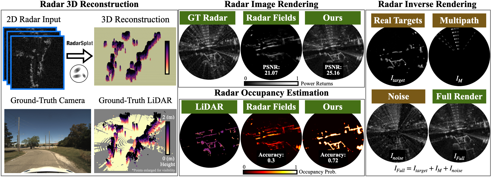

# RadarSplat

### RadarSplat: Radar Gaussian Splatting for High-Fidelity Data Synthesis and 3D Reconstruction of Autonomous Driving Scenes
**ICCV 2025**

Pou-Chun Kung, Skanda Harisha, Ram Vasudevan, Aline Eid, Katherine A. Skinner


[[Paper](https://arxiv.org/pdf/2506.01379)] |
[[Project Page](https://umautobots.github.io/radarsplat)]

<p align="center">
  
</p>

<details>
<summary> <b>Abstract (click to expand)</b> </summary>

High-Fidelity 3D scene reconstruction plays a crucial role in autonomous driving by enabling novel data generation from existing datasets. This allows simulating safety-critical scenarios and augmenting training datasets without incurring further data collection costs. While recent advances in radiance fields have demonstrated promising results in 3D reconstruction and sensor data synthesis using cameras and LiDAR, their potential for radar remains largely unexplored. Radar is crucial for autonomous driving due to its robustness in adverse weather conditions like rain, fog, and snow, where optical sensors often struggle. Although the state-of-the-art radar-based neural representation shows promise for 3D driving scene reconstruction, it performs poorly in scenarios with significant radar noise, including receiver saturation and multipath reflection. Moreover, it is limited to synthesizing preprocessed, noise-excluded radar images, failing to address realistic radar data synthesis. To address these limitations, this paper proposes RadarSplat, which integrates Gaussian Splatting with novel radar noise modeling to enable realistic radar data synthesis and enhanced 3D reconstruction. Compared to the state-of-the-art, RadarSplat achieves superior radar image synthesis (+3.4 PSNR / 2.6x SSIM) and improved geometric reconstruction (-40% RMSE / 1.5x Accuracy), demonstrating its effectiveness in generating high-fidelity radar data and scene reconstruction.

</details>

## Get Started

Clone the repo:
```bash
# Clone Repo
git clone --recursive https://github.com/umautobots/radarsplat.git
```

Conda environment prepare:
```bash
# Create conda environment
conda create --name radarsplat -y python=3.9
conda activate radarsplat
pip install --upgrade pip
```

Install CUDA based on your GPU:
```bash
# For CUDA 11.8 (change a to CUDA version that supports your GPU)
pip install torch==2.1.2+cu118 torchvision==0.16.2+cu118 --extra-index-url https://download.pytorch.org/whl/cu118
python -c "import torch; print(torch.__version__); print(torch.version.cuda); print(torch.cuda.get_device_name(0))"
conda install -c "nvidia/label/cuda-11.8.0" cuda-toolkit
pip install ninja git+https://github.com/NVlabs/tiny-cuda-nn/#subdirectory=bindings/torch
```

```bash
# For CUDA 12.8 (change a to CUDA version that supports your GPU)
pip install --pre torch torchvision torchaudio \
  --index-url https://pypi.org/simple \
  --extra-index-url https://download.pytorch.org/whl/nightly/cu128
python -c "import torch; print(torch.__version__); print(torch.version.cuda); print(torch.cuda.get_device_name(0))"
conda install -y -c nvidia cuda-toolkit=12.8
pip install ninja git+https://github.com/NVlabs/tiny-cuda-nn/#subdirectory=bindings/torch
```

Install RadarSplat:
```
# Install gsplat dependencies
cd examples
pip install -r requirements.txt

# Install other dependencies
pip install open3d
pip install wandb

cd ~/radarsplat
# Make sure the submodule is cloned recursively
git submodule update --init --recursive
# Install radarsplat/gsplat
pip install -e . --no-build-isolation --config-settings editable_mode=compat
```

#### TroubleShooting
```pip install -r requirements.txt``` can fail in some devices with this error:
```
ERROR: Could not find a version that satisfies the requirement jaxtyping==0.2.29 (from nerfview) (from versions: 0.0.1, 0.0.2, 0.1.0, 0.2.0, 0.2.1, 0.2.2, 0.2.3, 0.2.4, 0.2.5, 0.2.6, 0.2.7, 0.2.8, 0.2.9, 0.2.10, 0.2.11, 0.2.12, 0.2.13, 0.2.14, 0.2.15, 0.2.16, 0.2.17, 0.2.18, 0.2.19) ERROR: No matching distribution found for jaxtyping==0.2.29
```
To solve this, please comment out ```nerfview``` in ```requirements.txt``` and run:
```
pip install nerfview --no-deps
pip install jaxtyping==0.2.19
```

## Prepare Dataset
Download data from [Boreas Dataset](https://www.boreas.utias.utoronto.ca/#/download).
In the paper, we choose:

| Sequence Name             | Weather/Condition |
|-------------------------- |------------------|
| boreas-2021-09-02-11-42   | Sunny            |
| boreas-2021-01-26-11-22   | Snow             |
| boreas-2021-04-29-15-55   | Rain             |
| boreas-2021-09-14-20-00   | Night            |
| boreas-2021-04-08-12-44   | Sunny 2          |


If you want to test on other sequences, please make sure the selected sequences are not part of the [odom_test](https://github.com/utiasASRL/pyboreas/blob/eeb2b1bb302f5386eff7198858846f6d89675fda/pyboreas/data/splits.py#L42-L56) set, so that the ground truth poses are provided.


## Data Preprocessing
Install [pyboreas library](https://github.com/utiasASRL/pyboreas) for data preprocessing.
```bash
pip install asrl-pyboreas
```

Run the following Linux script to preprocess the data for a demo sequence. 
Note that this process may take some time to complete.
```bash
DATA_ROOT=<YOUR_PATH_TO_DATA>
cd radarsplat
bash boreas/data_processing/scripts/process_seq_paper.sh $DATA_ROOT boreas-2021-09-02-11-42 0.0596 68 && \
```

I you want full experiment reported in paper, run:
```bash
DATA_ROOT=<YOUR_PATH_TO_DATA>
cd radarsplat
bash boreas/data_processing/scripts/process_seq_paper.sh $DATA_ROOT boreas-2021-09-02-11-42 0.0596 411 && \
bash boreas/data_processing/scripts/process_seq_paper.sh $DATA_ROOT boreas-2021-01-26-11-22 0.0596 501 && \
bash boreas/data_processing/scripts/process_seq_paper.sh $DATA_ROOT boreas-2021-04-29-15-55 0.0596 271 && \
bash boreas/data_processing/scripts/process_seq_paper.sh $DATA_ROOT boreas-2021-09-14-20-00 0.0596 451 && \
bash boreas/data_processing/scripts/process_seq_paper.sh $DATA_ROOT boreas-2021-04-08-12-44 0.0596 386
```

The following folders will be created under each boreas sequence folder:
```
├── sensor.yaml
├── multipath_model
├── radar_average_map
├── radar_average_map_polar
├── radar_trajectory.tum
├── synced_lidar
└── synced_lidar_map_win5
```

## Run RadarSplat

Run experiments with a demo sequence:

```bash
cd ~/radarsplat/examples/demo_scripts
bash run_all_radarsplat.sh ./seq_demo.txt
```

Run **full experiments** in the paper:
```bash
cd ~/radarsplat/examples/demo_scripts
bash run_all_radarsplat.sh ./seq_all.txt
```
Run **method ablation** reported in the paper:
```bash
cd ~/radarsplat/examples/demo_scripts
bash run_all_radarsplat_abla.sh ./seq_all.txt
```
Run **Gaussian initialization ablation** studies:
```bash
cd ~/radarsplat/examples/demo_scripts
bash run_all_radarsplat_init_abla.sh ./seq_all.txt
```
Disable wandb by setting USE_WANDB=0 and change assigned GPU id by changing GPU=[ID] in ```run_all_radarsplat.sh, run_all_radarsplat_abla.sh, run_all_radarsplat_init_abla.sh```


## Evaluation
Run demo sequence evaluation.
```bash
python eval_summary.py ./examples/demo_scripts/seq_demo.txt
```

Run full evaluation.
```bash
python eval_summary.py ./examples/demo_scripts/seq_all.txt
```
You should see result like this:
```
------------- RadarSplat -------------
                  psnr  ssim  lpips
Image Eval. Mean 26.06  0.51   0.37
                   RMSE  R-CD  accuracy  precision  recall
Recon. Eval. Mean  1.81  0.04      0.91       0.71    0.94
                   Occ_RMSE  Occ_R-CD  Occ_accuracy
Recon. Eval. Mean      1.81      0.04          0.93
------------- [Ablation] RadarSplat w/o noise probability  -------------
                  psnr  ssim  lpips
Image Eval. Mean 23.52  0.23   0.59
                   RMSE  R-CD  accuracy  precision  recall
Recon. Eval. Mean  1.82  0.04      0.91       0.71    0.94
------------- [Ablation] RadarSplat w/o multipath modeling  -------------
                  psnr  ssim  lpips
Image Eval. Mean 25.95  0.50   0.37
                   RMSE  R-CD  accuracy  precision  recall
Recon. Eval. Mean  1.81  0.04      0.91       0.71    0.94
------------- [Ablation] RadarSplat w/o spectual leakage  -------------
                  psnr  ssim  lpips
Image Eval. Mean 25.95  0.50   0.39
                   RMSE  R-CD  accuracy  precision  recall
Recon. Eval. Mean  2.05  0.05      0.91       0.70    0.94
------------- [Ablation] RadarSplat w/o occupancy map  -------------
                  psnr  ssim  lpips
Image Eval. Mean 26.58  0.53   0.39
                   RMSE  R-CD  accuracy  precision  recall
Recon. Eval. Mean  1.86  0.23      0.30       0.66    0.30
...
```

## Rendering/Visualization
Render outputs from a trained model using all available frames (train + val) for evaluation and visualization.
```bash
python examples/radar_simple_trainer.py default --ckpt <CHECKPOINT_PATH> --eval_set all --save_fig --use_lidar_map
```

### TODO
- [x] Code Release
- [ ] Fix numerical instability
- [ ] Support novel view multipath rendering for ego shifting
- [ ] Clean up code for 3D reconstruction/visulization 
- [ ] Multi-GPU training


### Citation
If you find this repository helpful, please consider citing our paper.
```
@article{kung2025radarsplat,
  title={RadarSplat: Radar Gaussian Splatting for High-Fidelity Data Synthesis and 3D Reconstruction of Autonomous Driving Scenes},
  author={Kung, Pou-Chun and Harisha, Skanda and Vasudevan, Ram and Eid, Aline and Skinner, Katherine A},
  journal={arXiv preprint arXiv:2506.01379},
  year={2025}
}
```
